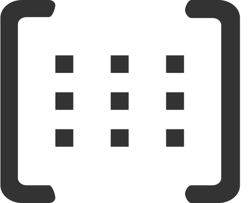

# Matrix 

## В данном проекте представлена реализация матриц в виде класса, и операций над матрицами в виде объектов данного класса

Понятие матрицы реализовано с помощью класса `Matrix`

Данный класс содержит поля `_matrix` - данные, `_rows` - строки, `_cols` - столбцы

## Все операции реализованы в виде публичных методов

 1) `bool eq_matrix(const Matrix& other)` - сравнение матриц
 2) `void sum_matrix(const Matrix& other)` - сложение текущей матрицы с другой
 3) `void sub_matrix(const Matrix& other)` - разность текущей матрицы с другой
 4) `void mul_number(const double num)` - домножение матрицы на число
 5) `void mul_matrix(const Matrix& other)` - домножение матрицы на другую матрицу
 6) `Matrix transpose()` - вычисление транспонированной матрицы от текущей
 7) `Matrix calc_complements()` - вычесление матрицы алгебраических дополнений от текущей
 8) `double determinant()` - вычисление определителя
 9) `Matrix inverse_matrix()` - вычисление обратной матрицы для текущей

## Дополнительно для упрощенного использования методов - реализована перегрузка операторов

 1) `Matrix operator+(const Matrix& other)` - сумма двух матриц (A * B)
 2) `Matrix operator-(const Matrix& other)` - разность двух матриц (A - B) 
 3) `Matrix operator*(const Matrix& other)` - произведение двух матриц (A * B)
 4) `Matrix operator*(const double num)` - произведение матрицы и числа (A * x)
 5) `friend Matrix operator*(const double num, const Matrix&)` - произведение числа и матрицы (x * A)
 6) `bool operator==(const Matrix& other)` - равенство двух матриц (A == B)
 7) `void operator=(const Matrix& other)` - присвоение значений одной матрицы в другую (A = B)
 8) `void operator+=(const Matrix& other)` - сложение одной матрицы к другой (A += B)
 9) `void operator-=(const Matrix& other)` - вычитание одной матрицы из другой (A -= B)
 10) `void operator*=(const Matrix& other)` - домножение матрицы на другую матрицу (A*= B)
 11) `void operator*=(const double num)` - домножение матрицы на число (A*= x)
 12) `double& operator()(const int i, const int j)` - получение ссылки на элемент матрицы по индексу A(i, j)

Cборка библиотеки осуществляется при помощи makefile с g++ верссии 9.4.0, на Linux. Unit-тесты написаны на gtest.Все исходные материалы и makefile находятся в папке src.